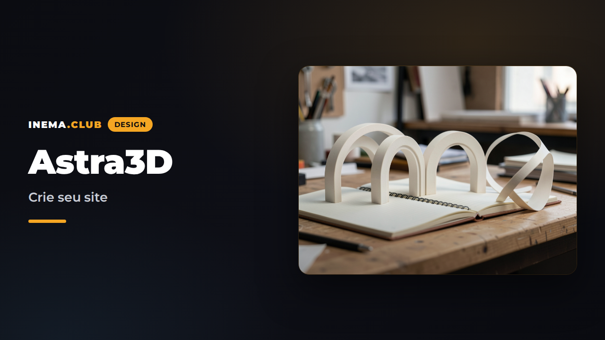

# Astra3D

**🇧🇷 [Português](README.md) · 🇺🇸 [English](README.en.md) · 🇪🇸 [Español](README.es.md)**

Un estudio visual para personalizar y exportar sitios con escenas 3D originales.

**[Abrir el editor](https://inematds.github.io/astra3d/)** · **[Guía de uso](https://inematds.github.io/astra3d/guia/es/)** · **[Plan de todas las versiones](docs/PLANO-VERSOES.md)**



## Disponible en la V2.0

- Órbita (portafolio), Forma (agencia) y Caderno (publicación).
- Editor visual con textos, imagen local, temas, fuentes, movimiento y secciones.
- Vista previa en computadora y celular usando el mismo HTML de la exportación.
- Hasta seis proyectos o artículos; detalles de lectura; búsqueda/categoría en Caderno.
- Biblioteca con proyectos independientes, cambio de nombre, duplicación, archivado/restauración, búsqueda y filtros.
- Hasta cinco versiones guardadas por proyecto, además de deshacer/rehacer durante la sesión.
- Copia de seguridad JSON de toda la biblioteca e importación como nuevas copias.
- Migración de los borradores V1 y detección de conflictos entre pestañas.
- [Demostración Órbita](https://inematds.github.io/astra3d/demos/portfolio/), [Forma](https://inematds.github.io/astra3d/demos/agency/) y [Caderno](https://inematds.github.io/astra3d/demos/journal/): sitios completos sin el editor.
- Importación/exportación JSON y descarga de un HTML independiente, con fuentes y escena incluidas.
- Movimiento reducido y contenido HTML accesible incluso sin WebGL.

No requiere cuenta ni clave de IA. El chat, los cuatro modelos avanzados y la publicación automática de sitios de los visitantes están **planificados, no implementados**. [Consulta el plan V1–V6](docs/PLANO-VERSOES.md).

## Desarrollo

Node.js 22.12+ o 24 y npm.

```sh
npm ci
npm run dev
```

```sh
npm test
npm run build
npm run preview
npx playwright install chromium
npm run test:e2e
```

La compilación genera el runtime 3D localmente y publica el editor, la guía y los planes en `dist/`. `src/generated` no está versionado. El workflow `.github/workflows/pages.yml` publica mediante GitHub Actions.

## Uso y datos

Explora una demostración → crea un proyecto → personalízalo → guarda una versión → exporta el HTML. Guarda la copia de seguridad de la biblioteca en Mis proyectos. Cambia el nombre del HTML a `index.html` y súbelo a un alojamiento estático. Los borradores no son copias de seguridad remotas: al limpiar el navegador, se borran. El editor no envía imágenes ni contenido a un servidor. Quien crea el sitio define los enlaces externos.

El aviso de contenido de ejemplo viene activado; desactívalo solo después de reemplazar los textos de demostración. No hay recopilación de correos electrónicos ni checkout ficticio.

## Documentación

- [Detalles de la V2.0 y próximas funciones V2.1–V2.2](docs/PLANO-V2.md)
- [Arquitectura y contrato de configuración](docs/ARQUITETURA.md)
- [Planes y criterios de aceptación](docs/PLANO-VERSOES.md)
- [Guía](guia/index.html)
- [Créditos y assets](docs/CREDITOS.md)

## Licencia

Código original bajo MIT. Las bibliotecas y fuentes conservan sus propias licencias; consulta los créditos. El PDF de referencia no se redistribuye.
