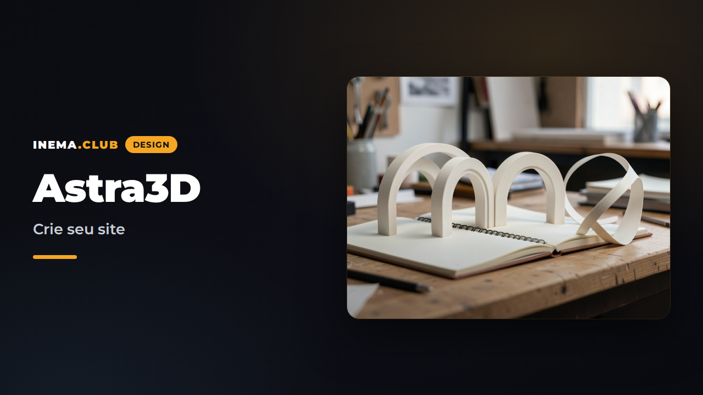

# Astra3D

Um estúdio visual para personalizar e exportar sites com cenas 3D originais.

**[Abrir o editor](https://inematds.github.io/astra3d/)** · **[Guia de uso](https://inematds.github.io/astra3d/guia/)** · **[Plano de todas as versões](docs/PLANO-VERSOES.md)**



## Disponível na V2.0

- Órbita (portfólio), Forma (agência) e Caderno (publicação).
- Editor visual com textos, imagem local, temas, fontes, movimento e seções.
- Prévia desktop/celular usando o mesmo HTML da exportação.
- Até seis projetos ou artigos; detalhes de leitura; busca/categoria no Caderno.
- Biblioteca com projetos independentes, renomeação, duplicação, arquivo/restauração, busca e filtros.
- Até cinco versões salvas por projeto, além de desfazer/refazer durante a sessão.
- Backup JSON de toda a biblioteca e importação como novas cópias.
- Migração dos rascunhos V1 e detecção de conflito entre abas.
- [Demonstração Órbita](https://inematds.github.io/astra3d/demos/portfolio/), [Forma](https://inematds.github.io/astra3d/demos/agency/) e [Caderno](https://inematds.github.io/astra3d/demos/journal/): sites completos sem o editor.
- Importação/exportação JSON e download de um HTML independente, com fontes e cena incluídas.
- Movimento reduzido e conteúdo HTML acessível mesmo sem WebGL.

Não exige conta nem chave de IA. O chat, os quatro modelos avançados e a publicação automática de sites dos visitantes estão **planejados, não implementados**. [Veja o plano V1–V6](docs/PLANO-VERSOES.md).

## Desenvolvimento

Node.js 22.12+ ou 24 e npm.

```sh
npm ci
npm run dev
```

```sh
npm test
npm run build
npm run preview
npx playwright install chromium
npm run test:e2e
```

O build gera o runtime 3D localmente e publica o editor, o guia e os planos em `dist/`. `src/generated` não é versionado. O workflow `.github/workflows/pages.yml` publica via GitHub Actions.

## Uso e dados

Explore uma demonstração → crie um projeto → personalize → salve uma versão → exporte HTML. Guarde o backup da biblioteca em Meus projetos. Renomeie o HTML para `index.html` e envie a uma hospedagem estática. Os rascunhos não são backups remotos: limpar o navegador os apaga. O editor não envia imagens ou conteúdo a um servidor. Links externos são definidos por quem cria o site.

O aviso de conteúdo de exemplo vem ativado; desative somente após substituir os textos demonstrativos. Não há coleta de e-mail ou checkout fictício.

## Documentação

- [Detalhes da V2.0 e próximos recursos V2.1–V2.2](docs/PLANO-V2.md)
- [Arquitetura e contrato de configuração](docs/ARQUITETURA.md)
- [Planos e critérios de aceite](docs/PLANO-VERSOES.md)
- [Guia](guia/index.html)
- [Créditos e assets](docs/CREDITOS.md)

## Licença

Código original sob MIT. Bibliotecas e fontes mantêm suas próprias licenças; veja os créditos. O PDF de referência não é redistribuído.
